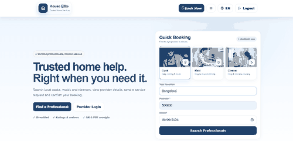
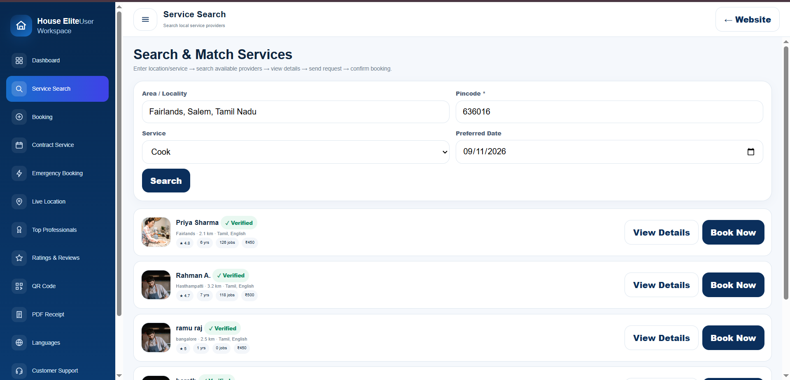
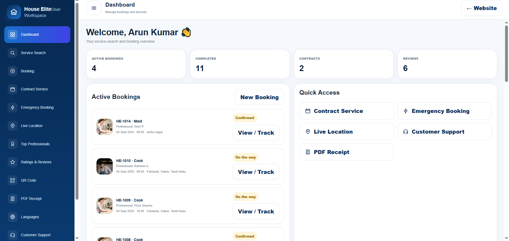
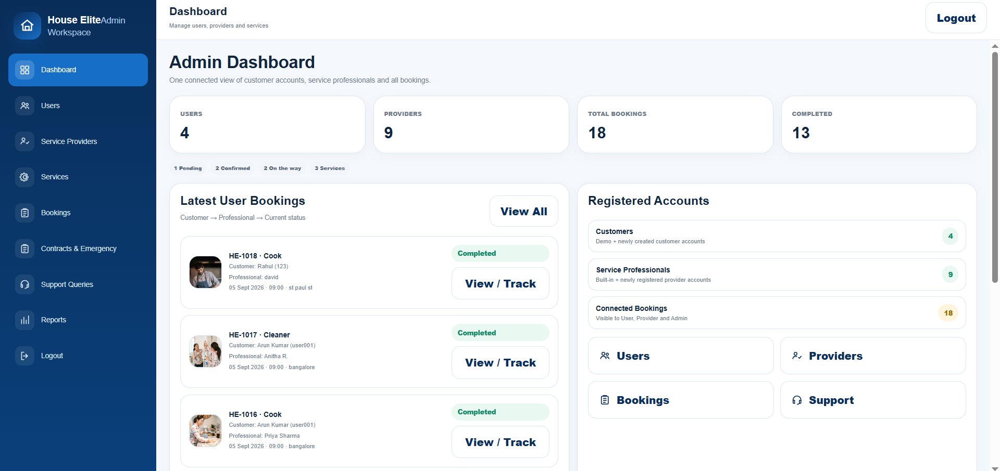

# House Elite – Home Services Booking & Management

House Elite is a responsive home-services web application designed to connect customers, service professionals, and administrators across Cook, Maid, and Cleaner service workflows.

## Live Demo

**[Launch House Elite Live Demo](https://houseeliterealapp.vercel.app/)**

> This repository is maintained as a portfolio showcase for the House Elite project. The complete deployable source code is kept private.

## Project Overview

House Elite provides a connected service workflow where customers can search professionals, create bookings, track service progress, raise contract and emergency requests, access previous service bills, and manage their profile. Service professionals can manage bookings, contracts, emergency requests, availability, earnings, location, ratings, and notifications. Administrators can manage users, providers, services, bookings, complaints, reports, and user account access.

## Key Features

- Role-based login for Customer, Service Professional, and Administrator
- Customer and Service Professional account registration
- Cook, Maid, and Cleaner service categories
- Quick Booking and Service Search
- Provider details with rating, experience, service area, language, jobs, and pricing
- Multi-step booking flow with service, provider, schedule, and confirmation
- Booking status tracking: Pending → Confirmed → On the way → Completed
- Customer dashboard with active bookings and previous service history
- Previous service bill access and downloadable PDF bills
- Contract Service requests
- Emergency Booking requests
- Service Professional booking management
- Service Professional availability and On Duty / Off Duty controls
- Service Professional earnings, ratings, notifications, location, and profile
- Admin dashboard and management modules
- User complaint handling with Remove / Restore account control
- Service verification QR
- QR-based UPI payment section in digital bills
- Device geolocation and Google Maps integration
- English / Tamil language support
- Responsive desktop and mobile interface

## Technologies Used

| Technology | Purpose |
|---|---|
| HTML5 | Application structure, forms, dashboards, and role-based screens |
| CSS3 | Responsive layouts, service cards, navigation, and interface styling |
| JavaScript | Authentication logic, booking workflows, status updates, account management, and UI behavior |
| localStorage | Browser-side application data persistence |
| BroadcastChannel API | Synchronizes House Elite state across open tabs in the same browser/origin |
| Storage Events | Additional cross-tab state update support |
| Geolocation API | Captures customer or provider device location with permission |
| Google Maps Embed / Links | Displays map context and opens service locations in Google Maps |
| Blob & URL APIs | Generates downloadable PDF service bills in the browser |
| Embedded QR Assets | Service verification QR and bill payment QR display |

## Application Flow

**Login / Register → Customer Home → Service Search → Select Provider → Schedule Service → Confirm Booking → Provider Accepts → Start Travel → Complete Service → Customer Tracking → Bill / PDF**

Additional connected workflows:

**Customer → Contract / Emergency Request → Assigned Service Professional → Status Update → Admin Record**

## Screenshots

### Role-Based Login

### Home & Quick Booking

### Service Search

### Customer Dashboard

### Service Professional Dashboard

### Admin Dashboard

## Project Highlights

- Connected Customer, Service Professional, and Administrator workflows
- Standard, Contract, and Emergency service request flows
- Service booking and progress tracking
- Dynamic customer and provider account registration
- Previous service history with downloadable bills
- Client-side PDF generation and QR functionality
- Customer complaint and account moderation controls
- Browser geolocation and Google Maps support
- English / Tamil interface support
- Responsive desktop and mobile experience

## Portfolio Notice

This repository is maintained as a portfolio showcase of the House Elite project. The complete deployable source code is maintained privately.

## Author

**Mohamed Yusuf**

[GitHub Profile](https://github.com/yusuf-digital) · [LinkedIn Profile](https://www.linkedin.com/in/mohamed-yusuf-ab2b6230a)
